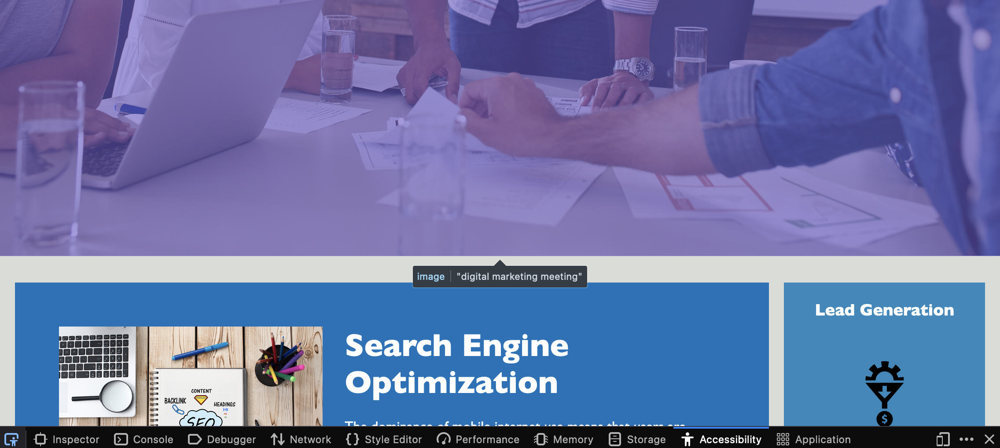

# Description

This website is a mock up, ensuring that it follows accessibility standards. The main objectives in this scenario was to:
1) remove redundancies and apply semantic tags
2) clean and rework the CSS
3) meet accessibility standards

# Installation

For any future use: files can be managed and edited through any IDE (VSCode recommended) and changes can be checked on a browser locally.

# Usage

Accessibility criteria can be verified using a browser to inspect accessibility properties.

